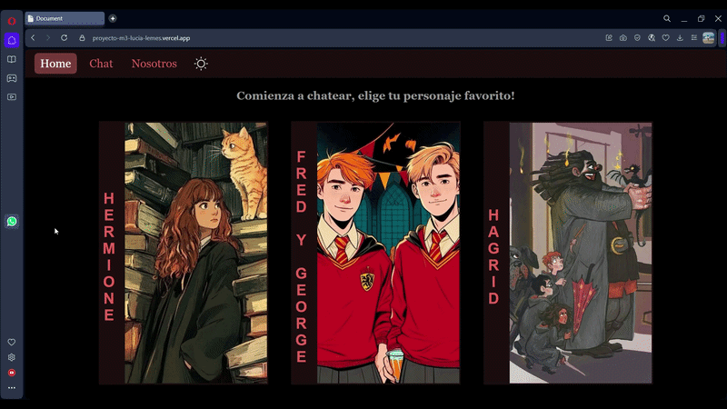
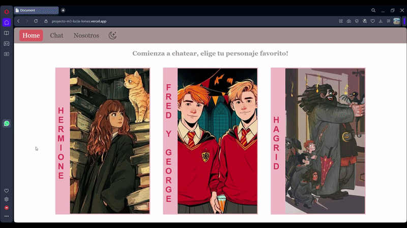

# Proyecto Integrador M3 - Chat IA
## Índice
- [Demo / URL pública](#demo--url-pública)
- [Descripción del proyecto](#descripción-del-proyecto)
- [Tecnologías usadas](#tecnologías-usadas)
- [Estructura del proyecto](#estructura-del-proyecto)
- [Funcionalidades](#funcionalidades)
- [Variables de entorno](#variables-de-entorno)
- [Cómo ejecutar el proyecto](#cómo-ejecutar-el-proyecto)
- [Despliegue en Vercel](#despliegue-en-vercel)
- [Personaje elegido / personalidad](#personaje-elegido--personalidad)
- [Decisiones técnicas](#decisiones-técnicas)
- [Uso de IA y documentación](#uso-de-ia-y-documentación)

## Demo / URL pública
El siguiente link te proporcionará acceso a la app:
https://proyecto-m3-lucia-lemes.vercel.app/

### Versión modo oscuro


### Versión modo claro



## Descripción del proyecto
El objetivo principal es crear una **Single Page Application (SPA)** que permita a los usuarios chatear con un personaje ficticio utilizando **Google Gemini AI**. La aplicación está diseñada con un enfoque **mobile-first**, garantizando una experiencia óptima en dispositivos móviles y adaptándose de forma responsive a diferentes tamaños de pantalla.

Cuenta con **navegación mediante routing** (Home, Chat, About), siendo la sección Chat el núcleo de la interacción en tiempo real con el personaje. Para proteger las credenciales, la comunicación con Google Gemini se realiza a través de **Vercel Functions**, evitando la exposición de la API Key en el cliente.

El proyecto incluye **tests unitarios** para asegurar la calidad del código y será desplegado en **Vercel**, aprovechando sus funciones serverless para ofrecer una solución moderna, escalable y segura.

[Volver al índice](#índice)
## Tecnologías usadas
- **HTML5**: estructura de la Single Page Application.
- **CSS3**: estilos con enfoque mobile-first y diseño responsive mediante media queries.
- **JavaScript (ES6+)**: lógica principal de la aplicación, manejo del DOM y estado del chat.
- **History API**: implementación del routing SPA (Home, Chat y About) sin recargar la página.
- **Fetch API**: comunicación entre el frontend y la función serverless.
- **Google Gemini AI**: generación de respuestas del personaje ficticio mediante inteligencia artificial.
- **Vercel Functions (Serverless)**: backend seguro para conectar con Gemini sin exponer la API Key.
- **Vitest**: testing unitario de funciones y lógica de la aplicación.
- **Vercel**: despliegue y hosting del proyecto en producción.
- **Git / GitHub**: control de versiones y gestión del repositorio.

[Volver al índice](#índice)
## Estructura del proyecto
```
project-root/
│
├── index.html                      # Contenedor base de la SPA
├── api/
│   ├── functions.js                # Serverless function para Gemini
│   └── payload.js                  # Define los datos que se envían en las solicitudes
├── src/
│   ├── styles.css                  # Todos los estilos
│   ├── state.js 		            # Estados globales de la SPA
│   ├── app.js                      # Punto de entrada de la SPA.
│   ├── utils.js                    # Funciones auxiliares (formateo, parseo, scroll)
│   ├── navigation.js               # SetupLinkInterceptor y popstate
│   ├── router.js                   # Router SPA (History API)
│   ├── views/                      # Carpeta de vistas
│   │   ├── home.js                 # Vista Home (bienvenida, botón para ir a chat)
│   │   ├── chat.js                 # Vista Chat (UI + eventos, usa servicios)
│   │   ├── notfound.js             # Vista para rutas no encontradas
│   │	├── setStatus.js            # Funciones para actualizar estados de UI
│   │	├── characters.js           # Datos de personajes y funciones auxiliares
│   │   └── about.js                # Vista About (info del proyecto y personaje)
│   └── services/
│       └── chatService.js          # Lógica de negocio: llamada a la API y manejo de historial
│
├── resource
│   ├── img/                        # Todas las imágenes utilizadas
│   ├── gifAPP/                     # Gif representativo de la APP
│   └── icons/                      # Todos los íconos utilizados
│ 
│   
├── tests/
│   ├── utils.test.js               # Tests unitarios para funciones de utils.js
│   └── app.test.js                 # Test para que se verifique que se inicializa app
│
├── .env                            # Variables de entorno (no subir al repo)
├── .env.example                    # Ejemplo de variables de entorno
├── .gitignore
├── package.json
├── package-lock.json
├── IADOC.md                        # Documentación de IA utilizada en el proyecto
└── README.md			            # Documentación del proyecto
```
[Volver al índice](#índice)
## Funcionalidades
- Chat en tiempo real con un personaje ficticio utilizando inteligencia artificial (Google Gemini).
- Interfaz de chat donde el usuario puede enviar mensajes y recibir respuestas del personaje.
- Mantenimiento del historial de conversación durante la sesión de navegación, incluyendo la posibilidad de cambiar entre 3 personajes distintos y conservar los chats de cada uno mientras no se recargue la página.
- Navegación entre vistas mediante routing SPA (Home, Chat y About) sin recargar la página.
- Diseño responsive con enfoque mobile-first, adaptable a distintos dispositivos.
- Estados de carga mientras se espera la respuesta de la IA.
- Manejo de errores en caso de fallas en la conexión con la API.
- Integración con Vercel Functions para comunicación segura con Gemini.

## Variables de entorno
Para que la aplicación funcione correctamente, es necesario configurar la API Key de Google Gemini en un archivo de variables de entorno. 

1. Crea un archivo `.env` en la raíz del proyecto (no debe subirse al repositorio).  
2. Copia la estructura del archivo `.env.example` y agrega tu API Key.

[Volver al índice](#índice)
## Cómo ejecutar el proyecto
(acá debe ir la explicación de cómo clonar el repositorio y ejecutar únicamente los tests localmente, ya que la aplicación se despliega directamente en Vercel)
Para ejecutar el proyecto de forma local, principalmente para correr los tests:

### 1. Clonar el repositorio
```bash
git clone https://github.com/tu-usuario/tu-repo.git
cd tu-repo
```
### 2. Instalar dependencias
```bash
npm install
```

### 3. Configurar variables de entorno

Crear un archivo `.env` basado en `.env.example`.

### Tests
El proyecto incluye tests unitarios utilizando **Vitest** para validar la lógica principal de la aplicación, especialmente el manejo del historial de mensajes y funciones utilitarias del sistema.

#### Herramientas utilizadas
- **Vitest** como framework de testing.
- JavaScript (ES Modules).

#### Qué se testea

Se implementaron tests unitarios sobre las funciones de `utils.js` y tests de integración ligera sobre `app.js`, que maneja el envío de mensajes al backend.

Funciones de utils.js: 

- El agregado de mensajes del usuario (`addUserMessage`), evitando mensajes vacíos o con solo espacios.
- El agregado de mensajes de la IA (`addIAMessage`).
- La obtención del historial de mensajes limitado (`getLastTenMessages`) y completo (`getAllMessages`).
- La limpieza del historial entre tests (`resetHistory`).
- La normalización de rutas (`normalizePath`).
- El correcto flujo de conversación entre usuario e IA.

Función sendMessage (en app.js):
- Se verifica que devuelva la respuesta simulada de la IA.
- Se simula el comportamiento de fetch mediante mocks para controlar la dependencia externa.
- Se asegura que se envía un POST al endpoint correcto con la estructura adecuada.
- Aunque simula la comunicación con el backend, se prueba dentro de un contexto cercano a la integración real.
- Comportamiento básico de inicialización de la aplicación sin errores.

### Ejecución de tests

```bash
npm run test
```
[Volver al índice](#índice)

### Ejecutar localmente con Vercel
Puedes probar la SPA localmente antes de realizar el despliegue en Vercel, debes realizar los siguientes pasos:
1. Instalar vercel CLI:
Abre tu terminal en la carpeta del proyecto y ejecuta:<br>
 `npm install -g vercel`<br>
*Esto instala el CLI de Vercel de manera global para poder usar el comando vercel desde cualquier lugar.*

2. Después de instalar, tenés que autenticarte:<br>
`vercel login`<br>
- Te va a pedir tu email de Vercel.
- Te envían un link de confirmación a tu correo.
- Una vez que hagas clic, la terminal quedará conectada a tu cuenta.

3. Si es la primera vez que conectás este proyecto:
```
vercel
```
Te pregunta cosas como:
- Nombre del proyecto (podés dejar el mismo que la carpeta)
- Qué carpeta desplegar (. si es la raíz)
- Framework o SPA (si no lo detecta, podés elegir “Other”)

Esto genera un archivo vercel.json opcional y configura tu proyecto.

4. Script
- Importante: Vercel necesita un build script (npm run build) para desplegar.
- Por lo que en nuestro package.json debemos agregar:
```
"local": "npx --yes vercel dev"
```
5. Para probar localmente:

En la terminal debes poner el siguiente código y esto te proporcionará la url local para probar.<br>
`npm run dev o vercel dev`

## Despliegue en Vercel

El proyecto está diseñado para desplegarse fácilmente en Vercel, incluso si aún no tienes una cuenta.  

### Pasos para desplegar:

1. **Crear una cuenta en Vercel**  
   Si no tienes una cuenta, regístrate aquí: [https://vercel.com/signup](https://vercel.com/signup)

2. **Importar el proyecto**  
   - Ingresa a tu dashboard de Vercel.  
   - Haz clic en **“New Project”** → **“Import Git Repository”**.  
   - Conecta tu repositorio de GitHub que contiene este proyecto.

3. **Configurar variables de entorno**  
   - En el panel del proyecto, ve a **Settings → Environment Variables**.  
   - Agrega la variable:  
     ```
     GEMINI_API_KEY=<tu_api_key_de_google_gemini>
     ```

4. **Hacer deploy**  
   - Haz clic en **Deploy**.  
   - Vercel detecta automáticamente que el proyecto es una SPA con serverless functions y lo desplegará correctamente.  

5. **Acceder a tu app**  
   - Una vez finalizado el deploy, obtendrás un enlace del tipo:  
     ```
     https://tu-app.vercel.app
     ```
   - Este será el URL público donde cualquiera podrá acceder a la aplicación.

[Volver al índice](#índice)

## Personaje elegido / personalidad
En la aplicación se puede chatear con tres personajes ficticios de la saga **Harry Potter**, cada uno con una personalidad y estilo de conversación distintivo:

### Hermione Granger
- **Personalidad:** Inteligente, lógica, académicamente precisa. Corrige errores y explica conceptos de manera clara y organizada.  
- **Estilo de conversación:** Firme pero nunca grosera, centrada en claridad y precisión. Hace referencias a teoría mágica y hechizos cuando es apropiado.  
- **Temperamento en chat:** Serio, detallista y educativo. Prioriza que el usuario entienda correctamente los temas.  

### Rubeus Hagrid
- **Personalidad:** Afectuoso, emocional y apasionado por las criaturas mágicas. Protege y defiende a los animales mágicos.  
- **Estilo de conversación:** Informal, entusiasta y cariñoso. Las explicaciones son vívidas, sinceras y a veces dispersas.  
- **Temperamento en chat:** Empático y protector. Más preocupado por el bienestar que por la precisión académica.  

### Fred y George Weasley
- **Personalidad:** Ingeniosos, traviesos y creativos. Siempre actúan como dos voces distintas que se complementan o discuten juguetonamente.  
- **Estilo de conversación:** Dinámico, humorístico y rápido. Las respuestas reflejan bromas, trucos y soluciones poco convencionales.  
- **Temperamento en chat:** Audaz y divertido. Mantienen conversaciones animadas y juguetonas, incluso sobre temas serios.  

> La aplicación permite **cambiar entre los tres personajes durante la sesión**, y cada chat mantiene su historial mientras la página no se recarga.

[Volver al índice](#índice)

## Decisiones técnicas
(acá debe ir un resumen de las decisiones importantes de arquitectura, diseño y manejo de API)
- **Arquitectura SPA:** Se implementó una Single Page Application con History API para una navegación fluida entre Home, Chat y About sin recargar la página.  
- **Manejo de personajes:** Cada personaje (Hermione, Hagrid, Fred y George) tiene su propio system prompt y parámetros de IA, permitiendo conversaciones diferenciadas y coherentes.  
- **Integración con IA segura:** La comunicación con Google Gemini se realiza a través de una Vercel Serverless Function, evitando exponer la API Key en el frontend.  
- **Historial de chat por personaje:** Se mantiene en memoria durante la sesión, permitiendo cambiar de personaje sin perder los mensajes de cada uno.  
- **Diseño mobile-first:** La interfaz prioriza dispositivos móviles, con adaptaciones responsive para tablet y desktop.  
- **Testing unitario:** Se validó la lógica principal del chat y utilidades del sistema con Vitest, asegurando correcto funcionamiento del core de la aplicación.

[Volver al índice](#índice)
## Uso de IA y documentación 
La documentación completa sobre la integración de Google Gemini AI, los prompts utilizados, el diseño de los system prompts y las decisiones tomadas usando IA se encuentra en un archivo separado:

[Ver documentación de IA](IADOC.md)

[Volver al índice](#índice)
